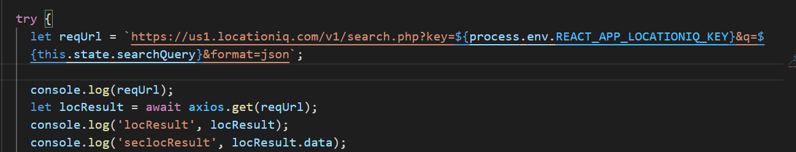
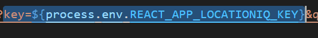
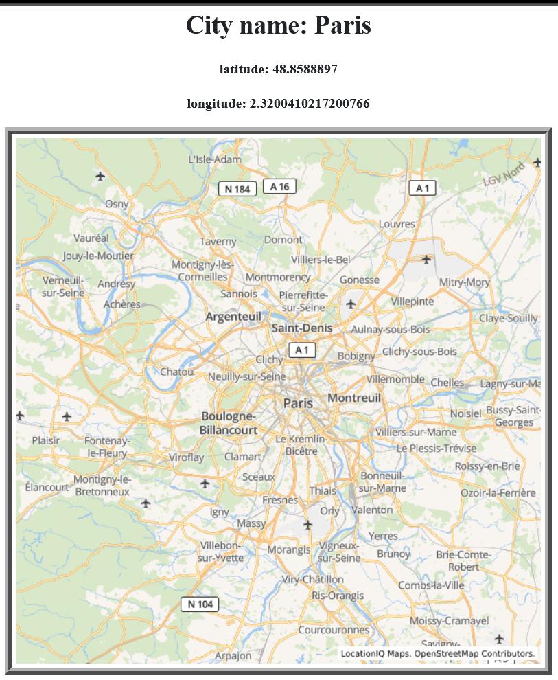
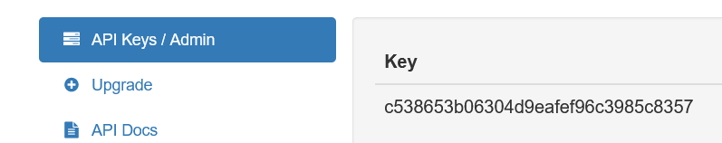
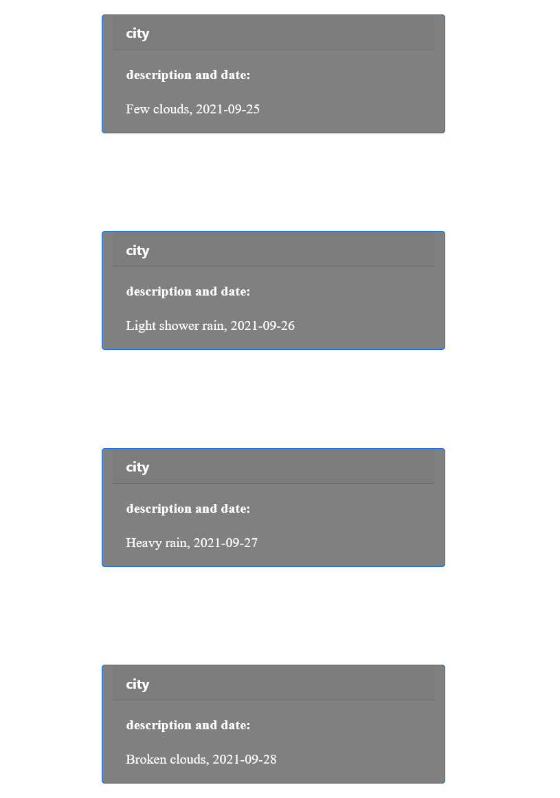

## READ-2-BTEC : Investigating APIs 

in our city explorer we used the following APIs:

### locationIQ:
 It transforms an address into spatial data and assigns the precise geographical coordinates to that location.
It is used in geographical information systems to assist in determining the coordinates of a location it offers  location-based solutions that are adaptable, they collaborate with developers, entrepreneurs, and organizations to serve the requests 

&nbsp;

### usage:

Requests can be submitted to any of the endpoints:
`GET https://us1.locationiq.com/v1/search.php?key=YOUR_ACCESS_TOKEN&q=SEARCH_STRING&format=json`

&nbsp;

### API Endpoints/Request URLs: 
A URL for a server is an API Endpoint, These APIs work with response and request, which means you make a request and the API Endpoint responds. 

assume that the URL `https://us1.locationiq.com/v1/search.php?key=YOUR_ACCESS_TOKEN&q=SEARCH_STRING`
the endpoint here is the path(query)

&nbsp;

### key Authenticatation:
The Authenticate API Key allows you to safely authenticate an API key with the API Gateway.
as you see here: 

so in my city explorer i used env to put the key so here is the key that is unique and different

&nbsp;

### so after using locationIQ:

---

### weatherBit

You may get current weather observations using our Weather API, The most up-to-date collection of historical weather, Multiple data sources are used, including station data

&nbsp;

### usage 
The current Weather API use summary for your API key subscription will be returned by this API. 

&nbsp;

### API Endpoints/Request URLs: 
endpoints are the whole URIs that comprise the corresponding REST API. 
so for example we have the base URL like this:  `http://api.weatherbit.io/v2.0/subscription/usage`
so the path here is the (city)
The key parameter is required for all API calls for example in my city explorer i used 4 day prediction for the cities(Paris, Amman ,Seattle). 
`https://api.weatherbit.io/v2.0/forecast/daily?city=${searchQuery},&key=${process.env.WEATHER_KEY}&days=4`

&nbsp;

### key Authenticatation:
in our city explorer we used API key 

i got the Key from here

&nbsp;

here is the data:

