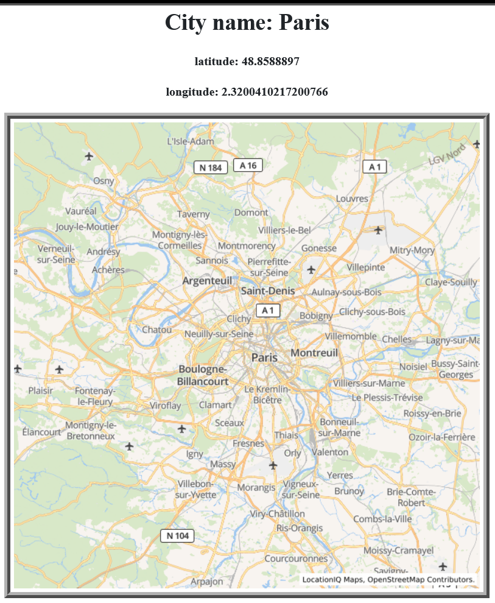

## Activity 3: Testing of the application 
Perform a white box and black box testing for the developed application, document the results

### what a white box testing?

White Box Testing is a software testing approach in which the underlying structure, architecture, and code of software are evaluated to ensure that the input-output flow is correct and to enhance design, usability, and security. Because code is visible to testers during white box testing.

we implemented city explorer that retrievs data about the weather, movies and location:
**functionality testing**

---

in my code i created env file to put the key like this:

**here is front end code**

### getting location

* in the frontEnd i have location API, so on the page will diplay the title ,latitude and longitude end point
`https://api.weatherbit.io/v2.0/forecast/daily?city=${searchQuery},&key=${process.env.WEATHER_KEY}&days=4`

* if the users click on submit they will see the data about the location Then the map of the city will display on the page. and it works correctly
here is the result:

### getting the weather

* in the backend we have GET listens for requests that match the provided route and method, and when a match is found, it runs the specified callback function.

* here as you see i created module called weather to return the data for a current weather in following cities (amman , seattle , paris) we make `axios` request to the weather API.

* the result works succesfully like this so i used this URL `https://api.weatherbit.io/v2.0/forecast/daily?city=${searchQuery},&key=${process.env.WEATHER_KEY}&days=4` from weatherBit API that will retrieve data for the 4 days with the description

---
 ### getting movie

 i created module for movie, The callback here make an axios request to The Movie DB API using the location info.
 in front i render the movie in a new component called movie.

 i made a test here so it works succesfully so that will return a top twenty movies like this: 

